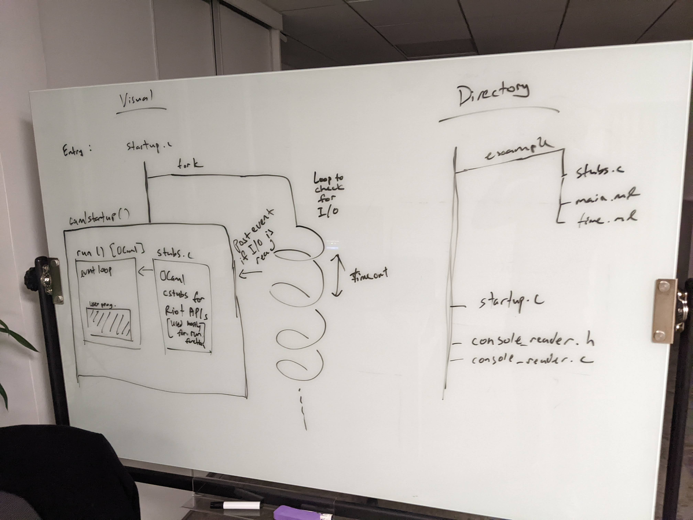

# 14/02 Monday
- Test and verify the sleep function
- Continue working on the run function

## Process
1. Lucas noticed that the run function doesn't make any call to the sleep function
2. Tried to write some tests for the sleep function to test if it is perfoming as expected instead of busy waiting

## Blockers
1. Not entirely sure what pieces of logic rely on the primatives and how the event-loop system is supposed to work at a high level.

# 15/02 Tuesday
- Complete minimal event loop run function with sleep API
- Start implementing the yield function

## Process
1. Code review with Lucas to see what is missing with the program. Talk about Lwt.poll and understand more clearly about how the Lwt scheduler works.
2. Convert Opam switch to use 32bit base compiler (from 4.11.2 onwards, there is a special way of initializing a switch which is to use -variants+options flag)
3. Work on cleaning up the code to correctly translate OCaml values into convenient types for the RIOT OS APIs whilst ensuring that our microsecond integers stay as int64 to prevent overflow. Also learned a bit about OCaml unboxed and heap allocated values.
4. Started to implement and debug the event_wait_timeout64() RIOT API stub.

## Blockers

- The queue->event_list->next get's changed from the event to 0x1 during CAMLparam2 macro. Not sure why.
- After talking to Lucas, the reason for this bug is that I was incorrectly allocated the address of the queue onto the stack and passing that value back to OCaml which expects it on the heap. 

# 16/02 Wednesday
- Start reading about UART in order to implementing console events

## Process
1. Tried to look for RIOT API's for input and output events
2. Lucas suggested to look more closely into the UART interface

## Blockers
- Cannot figure out how the UART fits into implementing console events

# 17/02 Thursday
- Figure out how to trigger event from STDIO events

## Process
1. Discussed with Lucas about how UART works
2. Looked into RIOT API's and found out that there is not much API's available for testing on UNIX
3. Try to think of workarounds and investigate if there are hacks that we can go use to go around this problem
4. Proposed schema:

## Blockers
- RIOT API's don't provide convenient functions to check if there is stdio_available under Unix. Therefore the current suggestion is to fork a thread to "busy wait" and perform a read to see if any characters have been written and post an event to the event queue. The problem is that it seems like the read function is blocking, so we might need to look for another API. 

# 18/02 Friday
- Work on schema
- Look for alternatives for our implementation

## Process
1. Tried to implement the console reader thread, but realised that the read function is blocking
2. Discussed with Lucas about the viability of emulating hardware to test the UART implementation
3. Looked into RIOT forums about how to overcome the UART limitation if not being able to test on native
4. Found out on this [tutorial page](https://github.com/iot-lab/iot-lab-training/blob/master/riot/basics/uart/uart.ipynb) that there is a way to reconfigure the UART interrupts to add events

## Blockers
- Figuring our how to write the code to implement adding events to the event queue instead of messages(which is what is used in the tutorial example)